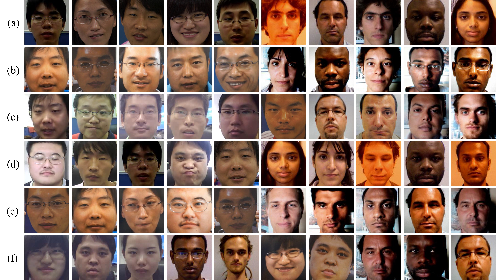

# PNS-release (The codes will be uploaded after the submitted paper is accepted)
## Results
#### Results of face anti-spoofing by the proposed method based on CASIA and Replay-Attack datasets.

(a) Examples of correctly detected as real faces in intra-dataset test.   (b) Examples of correctly detected as fake faces in intra-dataset test.   (c) Examples of the failure cases (i.e., real→fake (left five samples) and fake→real (right five samples)) in intra-dataset test.   (d) Examples of correctly detected as real faces in inter-dataset test.   (e) Examples of correctly detected as fake faces in inter-dataset test.   (f) Examples of the failure cases (i.e., real→fake (left five samples) and fake→real (right five samples)) in inter-dataset test.
